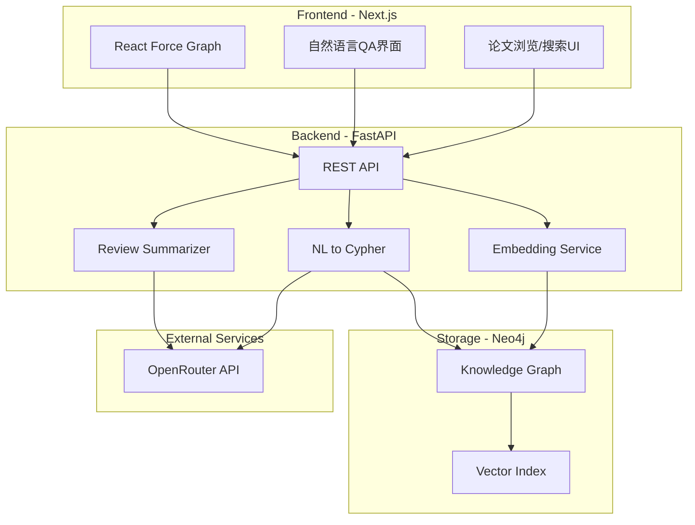
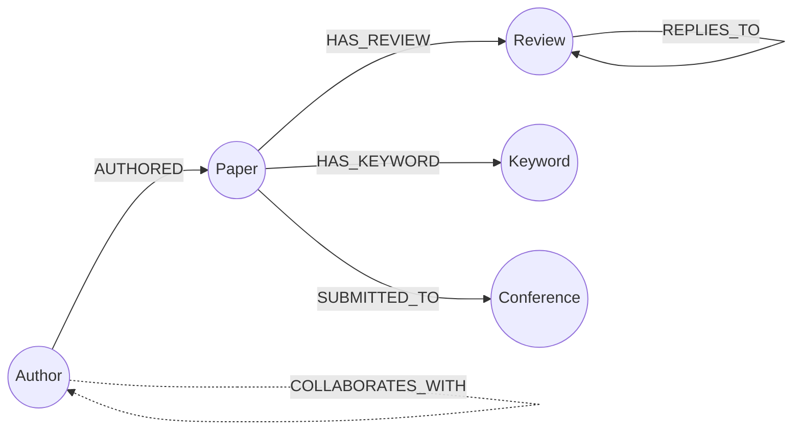

# AI顶会论文知识图谱QA系统

## 技术架构



## 知识图谱Schema



### 节点属性设计

| 节点 | 关键属性 | 向量索引 |

|------|----------|----------|

| **Paper** | id, title, abstract, status, creation_date, forum_link, pdf_link | abstract_embedding |

| **Author** | authorid(唯一), name | - |

| **Review** | id, replyto, cdate, review_type, rating, summary, strengths, weaknesses | content_embedding |

| **Keyword** | name | - |

| **Conference** | name, year, max_rating | - |

### 关系设计

| 关系 | 起点 | 终点 | 属性 |

|------|------|------|------|

| AUTHORED | Author | Paper | order(作者顺序) |

| HAS_REVIEW | Paper | Review | - |

| REPLIES_TO | Review | Review | - |

| HAS_KEYWORD | Paper | Keyword | - |

| SUBMITTED_TO | Paper | Conference | - |

## 项目结构

```
KG/
├── papers/                    # 数据集(已有)
├── backend/
│   ├── app/
│   │   ├── main.py           # FastAPI入口
│   │   ├── config.py         # 配置(Neo4j, OpenRouter)
│   │   ├── models/           # Pydantic模型
│   │   ├── routers/          # API路由
│   │   │   ├── papers.py     # 论文CRUD
│   │   │   ├── authors.py    # 作者查询
│   │   │   ├── qa.py         # QA接口
│   │   │   └── graph.py      # 图可视化数据
│   │   ├── services/
│   │   │   ├── neo4j_service.py
│   │   │   ├── llm_service.py
│   │   │   ├── embedding_service.py
│   │   │   └── nl2cypher.py
│   │   └── scripts/
│   │       └── ingest.py     # 数据导入脚本
│   └── requirements.txt
├── frontend/
│   ├── src/
│   │   ├── app/              # Next.js App Router
│   │   ├── components/       # UI组件
│   │   └── lib/              # 工具函数
│   └── package.json
└── docker-compose.yml        # Neo4j容器
```

## 实施步骤

### 第一阶段：图谱建模与数据入库

1. 启动Neo4j数据库(Docker)
2. 创建图谱Schema(约束、索引)
3. 编写数据导入脚本，解析三个JSONL文件
4. 处理Review类型识别(通过invitations字段判断)
5. 创建向量索引(abstract, review content)

### 第二阶段：后端API开发

1. FastAPI项目初始化
2. Neo4j连接服务
3. OpenRouter LLM服务封装
4. 实现核心API：

   - 论文列表/详情/搜索
   - 作者协作网络数据
   - 自然语言转Cypher查询
   - Review智能总结

### 第三阶段：前端开发

1. Next.js项目初始化
2. 论文浏览页(列表、筛选、分页)
3. 论文详情页(基本信息、Review时间线)
4. 作者页面 + React Force Graph可视化
5. QA对话界面

### 第四阶段：集成与优化

1. 前后端联调
2. 向量语义搜索调优
3. NL2Cypher prompt优化
4. UI/UX打磨

## 核心查询示例

```cypher
// 1. 查询ICLR2025平均分超过8分的论文关键词统计
MATCH (p:Paper)-[:SUBMITTED_TO]->(c:Conference {name: 'ICLR', year: 2025})
MATCH (p)-[:HAS_REVIEW]->(r:Review)
WHERE r.rating IS NOT NULL
WITH p, avg(r.rating) AS avg_rating
WHERE avg_rating > 8
MATCH (p)-[:HAS_KEYWORD]->(k:Keyword)
RETURN k.name AS keyword, count(*) AS count
ORDER BY count DESC

// 2. 获取作者协作网络
MATCH (a1:Author)-[:AUTHORED]->(p:Paper)<-[:AUTHORED]-(a2:Author)
WHERE a1.authorid < a2.authorid
RETURN a1, a2, count(p) AS collaborations
```

## 关键依赖

**后端:**

- `fastapi`, `uvicorn` - Web框架
- `neo4j` - 图数据库驱动
- `httpx` - 异步HTTP客户端(调用OpenRouter)
- `sentence-transformers` - 本地Embedding生成

**前端:**

- `next` - React框架
- `react-force-graph` - 2D/3D图可视化
- `tailwindcss` - 样式
- `shadcn/ui` - UI组件库